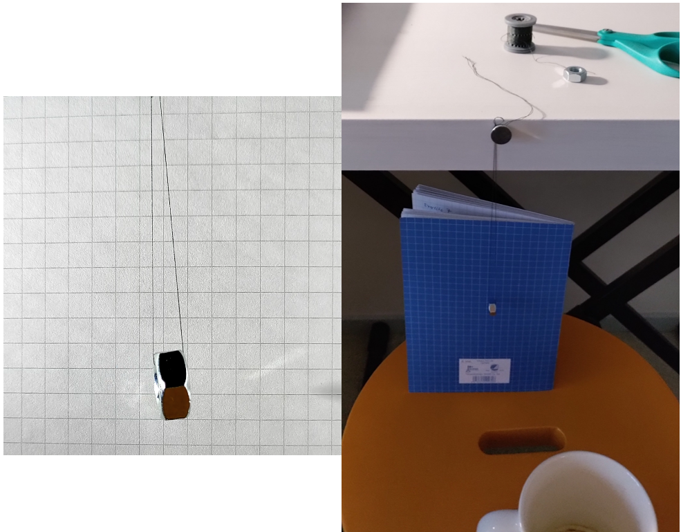

```{r setup, include=FALSE}
# This chunk sets echo = TRUE as default, that is print all code.
# knitr::opts_chunk$set can be used to set other notebook generation options, too.
# include=FALSE inside curly brackets makes this block not be included in the pdf.
knitr::opts_chunk$set(echo = TRUE)
```

```{r, results='hide', warning=FALSE, message=FALSE, echo = FALSE}
# The needed packages
library(cmdstanr)
set_cmdstan_path('/coursedata/cmdstan')
options(mc.cores = 1)
library(ggplot2)
library(gridExtra)
library(posterior)
library(reshape2)
library(loo)

# Data and give the columns meaningful names
nuts<-read.table("nuts.dat", sep = ",")
 colnames(nuts)<-c('t1', 'n1', 't2', 'n2')

# Set seed and enable the use of cmdstan code chunks
set.seed(5372)
register_knitr_engine(override = FALSE)

# Run Stan models or use previous results, 'HIER_fit.Rda' and 'POOLED_fit.Rda'
run_stan = FALSE
```

\newpage

# 1. Introduction

In this project, we apply Bayesian data analysis in order to deduce information about two pendulums, in this case two nuts swinging at the end of a string. There are multiple factors contributing on how the nuts oscillate: gravity, string length, and the mass and shape of the nuts, the latter of which affects the amount of air-resistance the pendulum undergoes. These properties of the pendulum determine the oscillation period and the how fast the oscillation dampens.

Most of the relevant properties of the pendulums are roughly known a priori, since they are either easily measurable (weight and string length) or generally known (gravity). However, the air-resistance is largely unknown although a theoretical upper bound can be calculated. Thus, the main goal of this project is to estimate the air-resistance of the nuts, and to analyse the possible differences between the oscillating nuts.

The rest of this report is organized as follows: In Section 2 we present the data used and explain how it was collected. In Section 3 we build differential equation -based Bayesian models to explain the data and present the corresponding Stan models. We use both hierarchical and non-hierarchical (pooled) models in order to first explain the data in a whole, and second find the possible differences between the two pendulums. In the hierarchical model, we assume that there can be differences in masses and air-resistances of the pendulums. In Section 4 we present and analyse the obtained results, and finally, Section 5 summarizes the project workflow.

# 2. Data and analysis problem

## The data

The data from the oscillating nut pendulums was obtained by making our own experiments: The nut was attached to the string and the system was hang from table edge using magnets to lock the string in place against the table edge, see the figure below. After attaching, the string length was measured using a ruler. Note that even though the right image in the figure below has blue background behind the nut, the left image represents the actual measurements as it is a snapshot from recorded footage.

```{r, echo=FALSE, fig.length = 4,fig.width = 8}
# Plot the image

```

The measurement device was phone camera, which was used to take video of the nut oscillations. The coffee mug in the above figure served as a camera stand. The video analysis and tracking was done using software named `Tracker`. The frames were first turned to binary images, which made the background fully white and the nut a black dot. After that the nut was easy to track and the x-coordinate of the nut was recorded.

Some initial raw data analysis was performed for the data as the mean of x-coordinate was set to zero to remove the bias. Then a suitable 700 data point long interval with roughly similar size initial amplitudes was chosen from both nuts. These are plotted below for the M8 and M10 nuts. Link to the data is in Appendix C.

```{r, echo=FALSE, fig.length = 4,fig.width = 8}
# Here we plot the measured data
p1 <- ggplot(data.frame(nuts)) + 
 geom_line(aes(x = t1, y = n1, color="M8 nut")) +
labs(x = "Time t [s]", y = "Signal") + 
  theme_classic()

p2 <- ggplot(data.frame(nuts)) + 
 geom_line(aes(x = t2, y = n2, color="M10 nut")) +
labs(x = "Time t [s]", y = "Signal") + 
  theme_classic()

grid.arrange(p1, p2, ncol=1)

```

## The analysis problem

In this project, we are mainly interested in two things: 1. Do the nuts oscillate similarly, i.e., whether there is some factor causing different oscillation, and 2. What are the air-resistances of the nuts. We will study these problems by first constructing a differential equation model, which these oscillations should follow. Then we will form two Bayesian models based on this differential equation: a pooled non-hierarchical model and a hierarchical model. With the pooled model we can study the oscillations of the nuts as a whole, and with the hierarchical model we can look for differences in the oscillations.

# 3. The models

## The dynamical model for damped harmonic oscillator

The model for the damped oscillator can be derived using Newton's second law for torque as follows:

$$
  \sum\vec{T}=J\ddot{\theta}\,,
$$

where the torques affecting on the mass (nut) are $\vec{T}$, the moment of inertia is denoted by $J$ and $\ddot{\theta}$ is the angular acceleration. Now, the torques are caused by gravity $\vec{G} = m\vec{g}$ and the air-resistance $\vec{F}_\mu = \mu\dot{\theta}$, and the moment of inertia for our system (effectively a point mass) is $J=ml^2$ [1]. With these the above equation becomes

$$
  -m\vec{g}r - \mu\dot{\theta} l = ml^2\ddot{\theta}\,.
$$

The air-resistance is always perpendicular to the string as it depends only on the velocity vector $\dot{\theta}$ and that is why it has $l$ while gravity has $r$. The value for $r$ can be determined by reasoning that it should be zero when $\theta$ is zero and $l$ when $\theta = \pi/2$, and thus sine function is the one we need. Because the angle $\theta$ was rather small in our measurements, we can use the small angle sine approximation $\sin(\theta) \approx \theta$. This gives us

$$
\begin{aligned}
  -mg\theta l - \mu\dot{\theta} l &= ml^2\ddot{\theta}\\
  \Rightarrow \ddot{\theta} & =- \frac{\mu}{ml}\dot{\theta} - \frac{g}{l}\theta\,.
\end{aligned}
$$

Now, out measurement are from the x-coordinate, which is related to $\theta$ as follows

$$
  \sin(\theta)=\frac{x}{l}\,.
$$

Using the small angle sine approximation again gives $\theta = \frac{x}{l}$ and placing that into the differential equation gives

$$
  \ddot{x} = -\frac{\mu}{ml}\dot{x} - \frac{g}{l}x.   \ \ \ \ \ (1)
$$

## Devising the prior scheme

The differential equation in (1) takes four parameters, which are the mass of the nut $m$, the string length $l$, air-resistance coefficient $\mu$ and the gravitational acceleration $g$. All of these parameters take positive values, because of the physical interpretation of them. In addition to those the numerical solutions will need the initial state of the system, i.e. initial position $x_0$ and initial velocity $\dot{x}_0$. Next we shall derive weakly informative or scale setting priors for all of these six parameters and the measurement noise $\sigma$. The priors will be normal and the scale $\sigma_i$ is obtained using

$$
  a = z_p \sigma_i\quad \Rightarrow \quad \sigma_i = \frac{a}{z_p}\,,
$$

where $a$ is the tolerance limit of the interval (for example $\pm$ 6) around the mean of parameter $i$ and $z_p$ is the multiplier for probability interval $p$ describing our certainty about the mean, for example 90% certainty gives $z_{90} = 1.64$.

The mass of the nut can be assumed to be quite certainly on some interval around the measured weight as nuts are standardized. Thus, we take conservative guess that the weight of nuts is normally distributed with mean of 0.012 kilograms and standard deviation $\sigma_m$ such that the mass is with 90% probability $\pm$ 8 grams from the mean. These give $\sigma_m = 0.0049$ kg, e.g. 4.9 grams.

The prior for the string length $l$ can be found in a similar manner: We measured it to be approximately 0.175 meters, but the ruler measurement was rather inaccurate so we use 90% interval of $\pm$ 0.05 meters (5 cm). This gives us $\sigma_l = 0.03$.

For the nut air-resistance we have no measurement or previous data, but we are sure that it is positive. The upper limit for the air-resistance parameter $\mu$ was determined using the fact that we have good prior knowledge about $m$, $l$ and $g$: In order to have under-damped solution for the system ODE (1), we need to have a characteristic equation with no real roots. This means that we should have

$$
  \frac{\mu^2}{m^2l^2}-4\frac{g}{l} < 0\,.
$$

Solving for $\mu$ gives

$$
  \mu < \sqrt{4m^2lg}\,,
$$

which allows us to determine upper limit by using the largest estimates for the other parameters. Placing $m$ = 0.030 kg, $l$ = 0.30 m and $g$ = 10 $\mathrm{m/s}^2$ gives upper limit of 0.10 $\mathrm{\frac{kg \times m}{s}}$ for the $\mu$ parameter. Thus the prior for $\mu$ was set to be uniform between 0 and 0.1.

The prior for gravitational acceleration $g$ can be assumed to be quite tight as it is a well known physical quantity. Thus, we say that it is 9.81 $\pm$ 0.05 $\mathrm{m/s}^2$ with 90% certainty, which yields a normal prior of form $N(9.81, 0.03)$.

The initial state of the pendulum is at the peak amplitude for both nuts, thus we can give the initial position and velocity the following estimates: $x_0$ = 0.008 $\pm$ 0.004 m with 90% certainty and $\dot{x}_0$ = 0 $\pm$ 0.05 m/s with certainty 50%. The $\pm$ 0.05 m/s was gotten from the $x(t)$ graphs, by looking at the maximum slope (maximum velocity). These give normal priors $p(x_0)\sim N(0.008, 0.002)$ and $p(\dot{x}_0)\sim N(0.0, 0.07)$.

## The likelihood model

Given some initial position $x_0$, velocity $\dot{x}_0$ and other parameters $\phi = (m,g,\mu,l)$ for the pendulum, we can simulate the oscillation of the pendulum according to equation (1) using `ode_rk45` in Stan. Our model contains some errors due to approximations and our data contains also some measurement error. In addition, there was some drift observed during the measurements, meaning the oscillation was not perfectly symmetrical. Thus, we can explain our data with the likelihood model $x_t \sim N(sim(x_{0},\dot{x}_{0},\phi,t),\sigma)$, where the function $sim$ gives the simulated position of the pendulum at time $t$ with the given initial conditions and other parameters. The standard deviation $\sigma$ encapsulates all of the previous mentioned reasons for differences between the simulation and actual data. For $\sigma$ we choose a weakly informative prior $\sigma \sim N(0,1)$ .

In the pooled model, we assume that the two nut pendulums are exactly the same, i.e. the mass, air-resistance, string length, and gravity are all equal between the two nuts. In addition, the model error and measurement accuracy is assumed to be similar in the two measurements. However, the initial positions and velocities of the pendulums can be different and are independent of each other.

Thus, the complete pooled model can be formulated as

$$
\begin{aligned}
x_{t,i} &\sim N(sim(x_{0,i},\dot{x}_{0,i},\phi,t),\sigma) \text{ for }i = 1,2\text{, } t = 1,...,700\text{, and where }\phi = (m, g, \mu, l). \\
\sigma &\sim N_+(0,1) \\
m &\sim N_+(0.012, 0.0049) \\
g &\sim N_+(9.81, 0.03) \\
\mu &\sim U(0,0.1) \\
l &\sim N_+(0.175, 0.03) \\
x_{0,i} &\sim N(0.008,0.002) \text{ for }i = 1,2\\
\dot{x}_{0,i} &\sim N(0.0,0.07) \text{ for }i = 1,2 
\end{aligned}
$$

In the hierarchical model, we allow differences in the masses and air-resistances of the nuts by introducing two hyper parameters: $m_0$ and $\mu_0$. The prior distribution for $\mu_0$ is the same as the prior distribution for air-resistance in the pooled model. We then assume that the air-resistances of the nuts are normally distributed with a mean $\mu_0$ and standard deviation $2\mu_0$. This choice for standard deviation can be justified by our lack of knowledge on the scale of $\mu_0$; with this choice the possible variation in the air-resistances of the nuts is on the right scale with the underlying hyper-parameter air-resistance $\mu_0$. The masses of the nuts are normally distributed with a mean $m_0$ and the same standard deviation (0.0049) as in the pooled model. However, since the damped harmonic oscillator problem is ill-posed (this is discussed more deeply in the results section), we can not give a wide prior to the mass hyper-parameter $m_0$ without making the problem unsolvable. Therefore, we choose $m_0 \sim N(0.012, 0.0005)$.

Thus, the complete hierarchical model can be formulated as

$$
\begin{aligned}
x_{t,i} &\sim N(sim(x_{0,i},\dot{x}_{0,i},\phi_i),\sigma)\text{ for }i = 1,2\text{,   }t = 1,...,700\text{, and where }\phi_i = (m_i, g, \mu_i, l). \\
\sigma &\sim N_+(0,1) \\
m_0 &\sim N_+(0.012, 0.0005) \\
m_i &\sim N_+(m_0, 0.0049)\text{ for }i = 1,2 \\
g &\sim N_+(9.81, 0.03) \\
\mu_0 &\sim U(0,0.1) \\
\mu_i &\sim N_+(\mu_0,2\mu_0) \\
l &\sim N_+(0.175, 0.03) \\
x_{0,i} &\sim N(0.008,0.002) \text{ for }i = 1,2\\
\dot{x}_{0,i} &\sim N(0.0,0.07) \text{ for }i = 1,2.
\end{aligned}
$$

## Stan implementation

The Stan models for the pooled and hierarchical models are below.

### Pooled model

```{cmdstan, output.var = "model_rk45_POOLED", eval=FALSE}

functions {

  // Function that encapsulates the dynamics of the system
  vector dx_dt(real t, vector x, real m, real l, real mu, real g) { 
    vector[2] dxdt;
    dxdt[1] = x[2];
    dxdt[2] = (-mu/(m*l))*x[2] -  (g/l)*x[1];
    return dxdt;
  }
  
  // Function that solves the ODE and returns the position array
  real[] simulate_x(int N, real[] t, vector s0, real m,
                    real l, real mu, real g){
    vector[2] z[N-1] = ode_rk45(dx_dt, s0, 0.0, t[2:N], m, l, mu, g);
    array[1] real x0;
    x0[1] = s0[1];
    real x_sim[N] = append_array(x0, z[,1]);
    return x_sim;
  }
}

// The problem data
data {
  int<lower=1> N;
  matrix[N,2] x;
  array[N,2] real ts;
  matrix[8, 2] pr_params; // Matrix for prior parameters
}

// The problem parameters
parameters {
  vector[2] state01;
  vector[2] state02;
  real<lower=0> sigma;
  real<lower=0.000001> m; // Prevent division by zero issues
  real<lower=0.0001> l; // Prevent division by zero issues
  real<lower=0> mu;
  real<lower=0> g;
}

// The ODE-transformation from params to simulated data
transformed parameters {
  real x_sim1[N] = simulate_x(N, ts[,1], state01, m, l, mu, g);
  real x_sim2[N] = simulate_x(N, ts[,2], state02, m, l, mu, g);
}

// The actual model
model {
  // The priors
  m ~ normal(pr_params[1,1], pr_params[1,2]);
  l ~ normal(pr_params[2,1], pr_params[2,2]);
  mu ~ uniform(pr_params[3,1], pr_params[3,2]);
  g ~ normal(pr_params[4,1], pr_params[4,2]);
  state01[1] ~ normal(pr_params[5,1], pr_params[5,2]); // Position of nut 1
  state01[2] ~ normal(pr_params[7,1], pr_params[7,2]); // Velocity of nut 1
  state02[1] ~ normal(pr_params[6,1], pr_params[6,2]); // Position of nut 2
  state02[2] ~ normal(pr_params[7,1], pr_params[7,2]); // Velocity of nut 2
  sigma ~ normal(pr_params[8,1], pr_params[8,2]);
  
  // The likelihood model
  for (t in 1:N) {
    x[t,1] ~ normal(x_sim1[t], sigma);
    x[t,2] ~ normal(x_sim2[t], sigma);
  }
}

// Computing the needed quantities for LOO-CV and other statistics
generated quantities {
  // Posterior draws
  real x_draws1[N] = simulate_x(N, ts[,1], state01, m, l, mu, g);
  real x_draws2[N] = simulate_x(N, ts[,2], state02, m, l, mu, g);
  
  // Log-likelihoods
  matrix[N,2] log_lik;
  for (t in 1:N){
    log_lik[t,1] = normal_lpdf(x[t,1] | x_sim1[t], sigma);
    log_lik[t,2] = normal_lpdf(x[t,2] | x_sim2[t], sigma);
  }
}

```

### Hierarchical model

```{cmdstan, output.var = "model_rk45_HIER", eval=FALSE}

functions {
  // Function that encapsulates the dynamics of the system
  vector dx_dt(real t, vector x, real m, real l, real mu, real g) { 
    vector[2] dxdt;
    dxdt[1] = x[2];
    dxdt[2] = (-mu/(m*l))*x[2] -  (g/l)*x[1];
    return dxdt;
  }
  
  // Function that solves the ODE and returns the position array
  real[] simulate_x(int N, real[] t, vector s0, real m,
                    real l, real mu, real g){
    vector[2] z[N-1] = ode_rk45(dx_dt, s0, 0.0, t[2:N], m, l, mu, g);
    array[1] real x0;
    x0[1] = s0[1];
    real x_sim[N] = append_array(x0, z[,1]);
    return x_sim;
  }
}

// The problem data
data {
  int<lower=1> N;
  matrix[N,2] x;
  array[N,2] real ts;
  matrix[9, 2] pr_params; // Matrix for prior parameters
}

// The problem parameters
// <lower=0.000001> is to prevent division by zero issues
parameters {
  vector[2] state01;
  vector[2] state02;
  real<lower=0> sigma;
  real<lower=0.000001> m0; // Mass hyper-parameter
  vector<lower=0.000001>[2] m; // Masses for both nuts 
  real<lower=0.0001> l; 
  real<lower=0> mu0; // Air-resistance hyper-parameter
  vector<lower=0>[2] mu; // Air-resistance for both nuts
  real<lower=0> g;
}

// The ODE-transformation from params to simulated data
transformed parameters {
  real x_sim1[N] = simulate_x(N, ts[,1], state01, m[1], l, mu[1], g);
  real x_sim2[N] = simulate_x(N, ts[,2], state02, m[2], l, mu[2], g);
}

// The actual model
model {
  // The priors
  m0 ~ normal(pr_params[1,1], pr_params[9,1]);
  l ~ normal(pr_params[2,1], pr_params[2,2]);
  mu0 ~ uniform(pr_params[3,1], pr_params[3,2]);
  g ~ normal(pr_params[4,1], pr_params[4,2]);
  state01[1] ~ normal(pr_params[5,1], pr_params[5,2]); // Position of nut 1
  state01[2] ~ normal(pr_params[7,1], pr_params[7,2]); // Velocity of nut 1
  state02[1] ~ normal(pr_params[6,1], pr_params[6,2]); // Position of nut 2
  state02[2] ~ normal(pr_params[7,1], pr_params[7,2]); // Velocity of nut 2
  sigma ~ normal(pr_params[8,1], pr_params[8,2]);
  
  // Hierarchical part
  for (n in 1:2) {
    m[n] ~ normal(m0, pr_params[1,2]);
    mu[n] ~ normal(mu0, 2*mu0);
  }
  
  // The likelihood model
  for (t in 1:N) {
    x[t,1] ~ normal(x_sim1[t], sigma);
    x[t,2] ~ normal(x_sim2[t], sigma);
  }
}

// Computing the needed quantities for LOO-CV and other statistics
generated quantities {
  // Posterior draws
  real x_draws1[N] = simulate_x(N, ts[,1], state01, m[1], l, mu[1], g);
  real x_draws2[N] = simulate_x(N, ts[,2], state02, m[2], l, mu[2], g);
  
  // Log-likelihoods
  matrix[N,2] log_lik;
  for (t in 1:N){
    log_lik[t,1] = normal_lpdf(x[t,1] | x_sim1[t], sigma);
    log_lik[t,2] = normal_lpdf(x[t,2] | x_sim2[t], sigma);
  }
}

```

## Running the models

The models were computationally heavy, and that is why they were ran using 6 parallel MCMC chains with 300 + 300 iterations per chain. This gave 1800 sampled points in total. Each chain had the initial points for the parameters specified as this ensured that the parameter values have non-zero probability. Using Stan standard initialization (uniform random between -2 and 2) could give for instance negative mass, which would cause problems with the ODE. The values for the initial points along with the prior parameters for both models are shown in the code chunks below:

### Pooled model

```{r}
# The prior parameters in a matrix -> no need to compile Stan model again 
prior_data <- matrix(nrow = 8, ncol = 2) 
prior_data[1,] <- c(0.012, 0.0049)     # Mass for the nut  
prior_data[2,] <- c(0.175, 0.03)       # Length of the string 
prior_data[3,] <- c(0, 0.1)            # The air-resistance parameter 
prior_data[4,] <- c(9.81, 0.03)        # Gravitational acceleration 
prior_data[5,] <- c(nuts$n1[1], 0.002) # Initial position of nut 1 
prior_data[6,] <- c(nuts$n2[1], 0.002) # Initial position of nut 2 
prior_data[7,] <- c(0, 0.07)           # Initial velocity 
prior_data[8,] <- c(0, 1)              # Measurement error (pointwise) 
 
# Data for the models 
data_rk45 <- list( 
  x = matrix(c(nuts$n1, nuts$n2), ncol = 2), 
  N = nrow(nuts), 
  ts = matrix(c(nuts$t1, nuts$t2), ncol = 2), 
  pr_params = prior_data 
) 
 
# Initial guesses
init_rk45 <- list( 
  list(m = 0.10, l = 0.7, mu = 0.05, g = 7, state0 = c(0.01, 0), sigma = 1), 
  list(m = 0.01, l = 0.01, mu = 0.0005, g = 10, state0 = c(0.003, 0), sigma = 0.1), 
  list(m = 0.15, l = 0.4, mu = 0.005, g = 7, state0 = c(0.01, 0), sigma = 1), 
  list(m = 0.05, l = 0.1, mu = 0.001, g = 10, state0 = c(0.003, 0), sigma = 0.1), 
  list(m = 0.19, l = 0.2, mu = 0.02, g = 7, state0 = c(0.01, 0), sigma = 1), 
  list(m = 0.03, l = 0.05, mu = 0.01, g = 10, state0 = c(0.003, 0), sigma = 0.1) 
) 

# The rk45 solver model: Solve the model or use previous solution
if(run_stan){
  fit_rk45_POOLED <- model_rk45_POOLED$sample(data = data_rk45, seed = 5372, chains = 6,
                                iter_sampling = 300, iter_warmup = 300,
                                refresh = 5, init = init_rk45)
} else {
  fit_rk45_POOLED <- readRDS("POOLED_fit.Rda")
}
draws_rk45_POOLED <- as_draws_df(fit_rk45_POOLED$draws())
```

### Hierarchical model

```{r}
# The prior parameters in a matrix -> no need to compile Stan model again 
prior_data <- matrix(nrow = 9, ncol = 2) 
prior_data[1,] <- c(0.012, 0.0049)     # Mass for the nut  
prior_data[2,] <- c(0.175, 0.03)       # Length of the string 
prior_data[3,] <- c(0, 0.1)            # The air-resistance parameter 
prior_data[4,] <- c(9.81, 0.03)        # Gravitational acceleration 
prior_data[5,] <- c(nuts$n1[1], 0.002) # Initial position of nut 1 
prior_data[6,] <- c(nuts$n2[1], 0.002) # Initial position of nut 2 
prior_data[7,] <- c(0, 0.07)           # Initial velocity 
prior_data[8,] <- c(0, 1)              # Measurement error (pointwise) 
prior_data[9,] <- c(0.0005, 1)         # Std dev of the mean of the mass 
 
 
# Data for the models 
data_rk45 <- list( 
  x = matrix(c(nuts$n1, nuts$n2), ncol = 2), 
  N = nrow(nuts), 
  ts = matrix(c(nuts$t1, nuts$t2), ncol = 2), 
  pr_params = prior_data 
) 
 
# Initial guesses
init_rk45 <- list( 
  list(m = c(0.010, 0.012), m0 = 0.01, l = 0.2, mu = c(0.05, 0.02), mu0 = 0.001,
       g = 9, state0 = c(0.01, 0), sigma = 1), 
  list(m = c(0.10, 0.01), m0 = 0.05, l = 0.01, mu = c(0.05, 0.02), mu0 = 0.001, 
       g = 10, state0 = c(0.003, 0), sigma = 0.1), 
  list(m = c(0.10, 0.01), m0 = 0.05, l = 0.4, mu = c(0.05, 0.02), mu0 = 0.001, 
       g = 7, state0 = c(0.01, 0), sigma = 1), 
  list(m = c(0.10, 0.01), m0 = 0.05, l = 0.1, mu = c(0.05, 0.02), mu0 = 0.001,  
       g = 10, state0 = c(0.003, 0), sigma = 0.1), 
  list(m = c(0.10, 0.01), m0 = 0.05, l = 0.2, mu = c(0.05, 0.02), mu0 = 0.001,  
       g = 7, state0 = c(0.01, 0), sigma = 1), 
  list(m = c(0.10, 0.01), m0 = 0.05, l = 0.01, mu = c(0.05, 0.02), mu0 = 0.001,  
       g = 10, state0 = c(0.003, 0), sigma = 0.1) 
) 

# The rk45 solver model: Solve the model or use previous solution
if(run_stan){
fit_rk45_HIER <- model_rk45_HIER$sample(data = data_rk45, seed = 5372, chains = 6,
                              iter_sampling = 300, iter_warmup = 300,
                              refresh = 5, init = init_rk451)
} else {
  fit_rk45_HIER <- readRDS(file = "HIER_fit.Rda")
}
draws_rk45_HIER <- as_draws_df(fit_rk45_HIER$draws())

```

# 4. Results

## Convergence

The convergence of both of the models was good with the first try when we ran a proper amount of iterations and chains. Thus, there was no need to do changes to the models on that account. Next, we will present the convergence analysis.

### $\hat{R}$-values and posterior trajectories

In the pooled model all $\hat{R}$ values of the variables are smaller than 1.01 (Table 1), which would imply that the chains have most likely converged. We also verified this by looking at the posterior trajectories of the chains. Below we have plotted the posterior values of the mass parameter $m$, which looks converged, i.e. the chains have mixed and oscillate around the same value.

```{r, echo=FALSE}
summary_pooled = fit_rk45_POOLED$summary()

tab_pooled <- matrix(c(round(summary_pooled$rhat[2:10],3)),ncol = 1) # Rhat values for the pooled model
rnames <- c("Initial position for M8 nut x0 [m]",
            "Initial velocity for M8 nut v0 [m/s]",
            "Initial position for M10 nut x0 [m]",
            "Initial velocity for M10 nut v0 [m/s]",
            "Measurement noise sigma [m]" ,
            "Mass m [kg]", "String length l [m]",
            "Air-resistance mu [kg*m/s]",
            "Gravitational acceleration g [m/s^2]")

rownames(tab_pooled) <- rnames
# Make a table and show it
knitr::kable(data.frame(tab_pooled), col.names = c("Rhat"),
             caption="The rhat values in the pooled model.")
```

```{r fig.align="center", echo = FALSE,fig.height = 4, fig.width = 8}
draws <- as_draws_df(fit_rk45_POOLED$draws())
param = draws$`m`
for (i in 0:5) {
plot(1:300,param[(i*300+1):(i*300+300)],"l",ylim = range(c(0,0.03)),
       col = i+1,ylab = "Mass",xlab = "Iteration", main = "Posterior mass chains of the pooled model")
par(new=TRUE)
}
```

Most of the $\hat{R}$ values for the hierarchical model (see Table 2) are also below 1.01, but there are also a few values slightly above 1.01 (but below 1.02). Those values come from the two mass parameters and two air-resistance parameters for the nuts. However, there is no sign that the chains would not have converged when looking at the posterior trajectories of these parameters. Below is an example of one of these trajectories, namely the air-resistance of the M8 nut. Thus, we can conclude that the convergence is good.

```{r, echo=FALSE}
summary_hier = fit_rk45_HIER$summary()

tab_pooled <- matrix(c(round(summary_hier$rhat[2:14],3)),ncol = 1) # Rhat
rnames <- c("Initial position for M8 nut x0 [m]", "Initial velocity for M8 nut v0 [m/s]", "Initial position for M10 nut x0 [m]",  "Initial velocity for M10 nut v0 [m/s]","Measurement noise sigma [m]" , "Hyper-mass m0 [kg]", "Mass of nut M8 [kg]", "Mass of nut M10 [kg]", "String length l [m]", "Hyper-air-resistance mu0 [kg*m/s]", "Air-resistance of nut M8 [kg*m/s]","Air-resistance of nut M10 [kg*m/s]", "Gravitational acceleration g [m/s^2]")

rownames(tab_pooled) <- rnames
# Make a table and show it
knitr::kable(data.frame(tab_pooled), col.names = c("Rhat"),
             caption="The rhat values in the hierarchical model.")
```

```{r fig.align="center", echo = FALSE,fig.height = 4, fig.width = 8}
draws <- as_draws_df(fit_rk45_HIER$draws())
param = draws$`mu[1]`
for (i in 0:5) {
plot(1:300,param[(i*300+1):(i*300+300)],"l",ylim = range(c(0,0.0006)),
       col = i+1,ylab = "Air-resistance of M8 nut",xlab = "Iteration", main = "Posterior air-resistance chains of the hierarchical model")
par(new=TRUE)
}
```

### HMC divergences and treedepths

In the pooled model the total number of divergences is zero. In the hierarchical model we had in total 2 transitions that ended with a divergence out of the 1800 samples in total. Thus, there is no problem with divergence.

Furthermore, only one transition (out of 1800) hit the maximum treedepth limit of 10 in the hierarchical model, and zero in the pooled model. This also confirms that the convergence of the chains is good.

```{r, echo=FALSE, eval = FALSE}
# Näitä ehkä ei tarvitse printata
# Divergences and tree depts 
fit_rk45_POOLED$diagnostic_summary()$num_divergent
fit_rk45_HIER$diagnostic_summary()$num_divergent
fit_rk45_POOLED$diagnostic_summary()$num_max_treedepth
fit_rk45_HIER$diagnostic_summary()$num_max_treedepth
```

### Effective sample size estimates

The effective sample size estimates (both $ess_{bulk}$ and $ess_{tail}$) for all of the parameters and for both models are given in the Tables 3 and 4. The smallest ESS comes from the pooled model from parameters $m$ and $\mu$, where the ESS is 320. This is quite small compared to the original number of samples 1800. However, this is still large enough that we can with confidence trust our posterior draws.

```{r, echo=FALSE}
tab_pooled <- matrix(c(round(summary_pooled$ess_bulk[2:10],-1),round(summary_pooled$ess_tail[2:10],-1)),ncol = 2)
rnames <- c("Initial position for M8 nut x0 [m]", "Initial velocity for M8 nut v0 [m/s]", "Initial position for M10 nut x0 [m]",  "Initial velocity for M10 nut v0 [m/s]","Measurement noise sigma [m]" , "Mass m [kg]", "String length l [m]", "Air-resistance mu [kg*m/s]", "Gravitational acceleration g [m/s^2]")

rownames(tab_pooled) <- rnames
# Make a table and show it
knitr::kable(data.frame(tab_pooled), col.names = c("ESS_bulk","ESS_tail"),
             caption="The effective sample sizes in the pooled model.")

tab_pooled <- matrix(c(round(summary_hier$ess_bulk[2:14],-1),round(summary_hier$ess_tail[2:14],-1)),ncol = 2)
rnames <- c("Initial position for M8 nut x0 [m]", "Initial velocity for M8 nut v0 [m/s]", "Initial position for M10 nut x0 [m]",  "Initial velocity for M10 nut v0 [m/s]","Measurement noise sigma [m]" , "Hyper-mass m0 [kg]", "Mass of nut M8 [kg]", "Mass of nut M10 [kg]", "String length l [m]", "Hyper-air-resistance mu0 [kg*m/s]", "Air-resistance of nut M8 [kg*m/s]","Air-resistance of nut M10 [kg*m/s]", "Gravitational acceleration g [m/s^2]")

rownames(tab_pooled) <- rnames
# Make a table and show it
knitr::kable(data.frame(tab_pooled), col.names = c("ESS_bulk", "ESS_tail"),
             caption="The effective sample sizes in the hierarchical model.")

```

## Model checking

### Pareto-$\hat{k}$ estimates

The Pareto-$\hat{k}$ estimates for both models are show below. They are all below 0.5 which is considered to be good. Thus, we can trust the PSIS-LOO-CV values computed next.

```{r fig.align="center", echo = FALSE,fig.height = 3, fig.width = 6}
# PSIS-LOO
#par(mfrow=c(2,1)), 7 ja 6
log_lik_pooled <-as_draws_array(fit_rk45_POOLED$draws("log_lik"))
r_eff_pooled <- relative_eff(exp(-log_lik_pooled))
psis_rk45 <- psis(-log_lik_pooled, r_eff = r_eff_pooled)
plot(psis_rk45, main = "Pareto-k for pooled model")

# PSIS-LOO
log_lik_hier <-as_draws_array(fit_rk45_HIER$draws("log_lik"))
r_eff_hier <- relative_eff(exp(-log_lik_hier))
psis_rk45 <- psis(-log_lik_hier, r_eff = r_eff_hier)
plot(psis_rk45, main="Pareto-k for hierarchical model")
```

### PSIS-LOO-CV scores

The PSIS-LOO-CV estimates are 7750 for the pooled model and 7761 for the hierarchical model. The effective number of parameters $p_{eff}$ is 8.8 for the pooled model and 10.3 for the hierarchical model. Thus, it seems that the differences in the performances of the models are very small. The hierarchical model has a slightly larger PSIS-LOO-CV score, but it also has a larger effective number of parameters.

```{r, echo=FALSE, warning=FALSE, include=FALSE}
loo(log_lik_pooled, r_eff = r_eff_pooled)$elpd_loo # PSIS-LOO-CV for pooled model
loo(log_lik_hier, r_eff = r_eff_hier)$elpd_loo   # PSIS-LOO-CV for hierarchical model
```

### Posterior predictive checking and model comparison

The posterior draws together with the original data are plotted below for both nuts and both the pooled and hierarchical model. The posterior draws are very similar among each other in both of the models, and there is also almost no visible differences between the models. With the M10 nut, the data fits to the posterior draws pretty well, except for the fact that there were some drift during the measurement, causing the nut to momentarily swing more to the other side. This is something that our model can not take into account. However, the oscillation period and amplitude are well estimated. With the M8 nut the fit of the model is not as good as with M10 nut. It seems that in the M8 data there is in general more noise, and also the oscillation is biased to the negative $x$ direction meaning that the amplitude in that direction is larger. However, again the oscillation period and average amplitude are well estimated. Thus it seems that both of our models find the "ideal" oscillations that these nuts would have gone through if there were no sources of error.

Since the models seem very similar in most aspects, we could choose either of the models. Based on PSIS-LOO-CV scores alone, one could choose hierarchical for the final model as it has a higher score, or one could choose the pooled model as it is simpler.

```{r fig.align="center", echo = FALSE,fig.length = 4,fig.width = 8}

# 1st nut
# Plot the posterior draw trajectories
x_traj <- as_draws_matrix(fit_rk45_POOLED$draws("x_draws1"))
nd <- nrow(x_traj)
df <- data.frame(x_traj)
colnames(df) <- round(nuts$t1, 2)

#df$id <- rownames(df)
#plot_data <- melt(df, id.var = "id")
#ggplot(plot_data) + geom_line(aes(x=variable,y=value,group=id, color="Posterior draws")) +
#  geom_line(data = data.frame(nuts), aes(x = t1*15.75, y = n1, color="M8 nut measured")) +
#  theme(axis.text.x = element_blank(),axis.ticks = element_blank()) + 
#  labs(x = "Time t [s]", y = "Signal")

test_df <- data.frame(t(rbind(nuts$t1, x_traj)))
ggplot(test_df) +
  geom_line(data = data.frame(nuts), aes(x = t1, y = n1, color="M8 nut measured")) +
  geom_line(aes(x=test_df[,1], y=test_df[,2], color="M8 Posterior draws")) +
  geom_line(aes(x=test_df[,1], y=test_df[,50], color="M8 Posterior draws")) +
  geom_line(aes(x=test_df[,1], y=test_df[,100], color="M8 Posterior draws")) +
  geom_line(aes(x=test_df[,1], y=test_df[,150], color="M8 Posterior draws")) +
  geom_line(aes(x=test_df[,1], y=test_df[,200], color="M8 Posterior draws")) +
  geom_line(aes(x=test_df[,1], y=test_df[,250], color="M8 Posterior draws")) +
  geom_line(aes(x=test_df[,1], y=test_df[,300], color="M8 Posterior draws")) +
  labs(x = "Time t [s]", y = "Signal") + 
   ggtitle("M8 posterior draws from the pooled model") + 
  theme_classic()

# 2nd nut

# Plot the posterior draw trajectories
x_traj <- as_draws_matrix(fit_rk45_POOLED$draws("x_draws2"))
nd <- nrow(x_traj)
df <- data.frame(x_traj)
colnames(df) <- round(nuts$t2, 2)

#df$id <- rownames(df)
#plot_data <- melt(df, id.var = "id")
#ggplot(plot_data) + geom_line(aes(x=variable,y=value,group=id, color="Posterior draws")) +
#  geom_line(data = data.frame(nuts), aes(x = t2*15.75, y = n2, color="M10 nut measured")) +
#  theme(axis.text.x = element_blank(),axis.ticks = element_blank()) + 
#  labs(x = "Time t [s]", y = "Signal")

test_df <- data.frame(t(rbind(nuts$t2, x_traj)))
ggplot(test_df) +
  geom_line(data = data.frame(nuts), aes(x = t2, y = n2, color="M10 nut measured")) +
  geom_line(aes(x=test_df[,1], y=test_df[,2], color="M10 Posterior draws")) +
  geom_line(aes(x=test_df[,1], y=test_df[,50], color="M10 Posterior draws")) +
  geom_line(aes(x=test_df[,1], y=test_df[,100], color="M10 Posterior draws")) +
  geom_line(aes(x=test_df[,1], y=test_df[,150], color="M10 Posterior draws")) +
  geom_line(aes(x=test_df[,1], y=test_df[,200], color="M10 Posterior draws")) +
  geom_line(aes(x=test_df[,1], y=test_df[,250], color="M10 Posterior draws")) +
  geom_line(aes(x=test_df[,1], y=test_df[,300], color="M10 Posterior draws")) +
  labs(x = "Time t [s]", y = "Signal") + 
  ggtitle("M10 posterior draws from the pooled model") + 
  theme_classic()
```

```{r fig.align="center", echo = FALSE,fig.length = 4,fig.width = 8}

# 1st nut
# Plot the posterior draw trajectories
x_traj <- as_draws_matrix(fit_rk45_HIER$draws("x_draws1"))
nd <- nrow(x_traj)
df <- data.frame(x_traj)
colnames(df) <- round(nuts$t1, 2)

#df$id <- rownames(df)
#plot_data <- melt(df, id.var = "id")
#ggplot(plot_data) + geom_line(aes(x=variable,y=value,group=id, color="Posterior draws")) +
#  geom_line(data = data.frame(nuts), aes(x = t1*15.75, y = n1, color="M8 nut measured")) +
#  theme(axis.text.x = element_blank(),axis.ticks = element_blank()) + 
#  labs(x = "Time t [s]", y = "Signal")

test_df <- data.frame(t(rbind(nuts$t1, x_traj)))
ggplot(test_df) +
  geom_line(data = data.frame(nuts), aes(x = t1, y = n1, color="M8 nut measured")) +
  geom_line(aes(x=test_df[,1], y=test_df[,2], color="M8 Posterior draws")) +
  geom_line(aes(x=test_df[,1], y=test_df[,50], color="M8 Posterior draws")) +
  geom_line(aes(x=test_df[,1], y=test_df[,100], color="M8 Posterior draws")) +
  geom_line(aes(x=test_df[,1], y=test_df[,150], color="M8 Posterior draws")) +
  geom_line(aes(x=test_df[,1], y=test_df[,200], color="M8 Posterior draws")) +
  geom_line(aes(x=test_df[,1], y=test_df[,250], color="M8 Posterior draws")) +
  geom_line(aes(x=test_df[,1], y=test_df[,300], color="M8 Posterior draws")) +
  labs(x = "Time t [s]", y = "Signal") + 
  ggtitle("M8 posterior draws from the hierarchical model") + 
  theme_classic()

# 2nd nut

# Plot the posterior draw trajectories
x_traj <- as_draws_matrix(fit_rk45_HIER$draws("x_draws2"))
nd <- nrow(x_traj)
df <- data.frame(x_traj)
colnames(df) <- round(nuts$t2, 2)

#df$id <- rownames(df)
#plot_data <- melt(df, id.var = "id")
#ggplot(plot_data) + geom_line(aes(x=variable,y=value,group=id, color="Posterior draws")) +
#  geom_line(data = data.frame(nuts), aes(x = t2*15.75, y = n2, color="M10 nut measured")) +
#  theme(axis.text.x = element_blank(),axis.ticks = element_blank()) + 
#  labs(x = "Time t [s]", y = "Signal")

test_df <- data.frame(t(rbind(nuts$t2, x_traj)))
ggplot(test_df) +
   geom_line(data = data.frame(nuts), aes(x = t2, y = n2, color="M10 nut measured")) +
  geom_line(aes(x=test_df[,1], y=test_df[,2], color="M10 Posterior draws")) +
  geom_line(aes(x=test_df[,1], y=test_df[,50], color="M10 Posterior draws")) +
  geom_line(aes(x=test_df[,1], y=test_df[,100], color="M10 Posterior draws")) +
  geom_line(aes(x=test_df[,1], y=test_df[,150], color="M10 Posterior draws")) +
  geom_line(aes(x=test_df[,1], y=test_df[,200], color="M10 Posterior draws")) +
  geom_line(aes(x=test_df[,1], y=test_df[,250], color="M10 Posterior draws")) +
  geom_line(aes(x=test_df[,1], y=test_df[,300], color="M10 Posterior draws")) +
  labs(x = "Time t [s]", y = "Signal") + 
  ggtitle("M10 posterior draws from the hierarchical model") + 
  theme_classic()
```

## Numerical results for the parameters

The means of the posterior draws for all parameters and for both models in Tables 5 and 6. The posterior histograms are in Appendix B. Overall, the means of the parameters are roughly the same when comparing the two models. In the pooled model the mean of the air-resistance is $2.2\times 10^{-4}\frac{kg\times m}{s}$ and the mean of the mass is $14$ grams. In the hierarchical model we get air-resistances of $2.4\times 10^{-4}\frac{kg\times m}{s}$ and $2.0\times 10^{-4}\frac{kg\times m}{s}$ for the nuts M8 and M10, respectively. The masses are 13 grams for both nuts. Thus, with these results it is hard to tell whether there are any differences between the two nuts. However, there is most likely a small difference how these nuts have oscillated since the air-resistance estimates are slightly different for the nuts.

```{r, echo=FALSE, message=FALSE, warning=FALSE}
# Compute statistics for pooled model and tabulate
tab_pooled <- matrix(nrow = 9, ncol = 3 )
rnames <- c()
tab_pooled[1,] <- c(mean(draws_rk45_POOLED$`m`), mcse_mean(draws_rk45_POOLED$`m`), round(mean(draws_rk45_POOLED$`m`),-1-floor(log10(mcse_mean(draws_rk45_POOLED$`m`)))))
rnames[1] <- "Mass m [kg]"
tab_pooled[2,] <- c(mean(draws_rk45_POOLED$`l`), mcse_mean(draws_rk45_POOLED$`l`),round(mean(draws_rk45_POOLED$`l`),-1-floor(log10(mcse_mean(draws_rk45_POOLED$`l`)))))
rnames[2] <- "String length l [m]"
tab_pooled[3,] <- c(mean(draws_rk45_POOLED$`mu`), mcse_mean(draws_rk45_POOLED$`mu`),round(mean(draws_rk45_POOLED$`mu`),-1-floor(log10(mcse_mean(draws_rk45_POOLED$`mu`)))))
rnames[3] <- "Air-resistance mu [kg*m/s]"
tab_pooled[4,] <- c(mean(draws_rk45_POOLED$`g`), mcse_mean(draws_rk45_POOLED$`g`),round(mean(draws_rk45_POOLED$`g`),-1-floor(log10(mcse_mean(draws_rk45_POOLED$`g`)))))
rnames[4] <- "Gravitational acceleration g [m/s^2]"
tab_pooled[5,] <- c(mean(draws_rk45_POOLED$`sigma`), mcse_mean(draws_rk45_POOLED$`sigma`),round(mean(draws_rk45_POOLED$`sigma`),-1-floor(log10(mcse_mean(draws_rk45_POOLED$`sigma`)))))
rnames[5] <- "Measurement noise sigma [m]"
tab_pooled[6,] <- c(mean(draws_rk45_POOLED$`state01[1]`), mcse_mean(draws_rk45_POOLED$`state01[1]`),round(mean(draws_rk45_POOLED$`state01[1]`),-1-floor(log10(mcse_mean(draws_rk45_POOLED$`state01[1]`)))))
rnames[6] <- "Initial position for M8 nut x01 [m]"
tab_pooled[7,] <- c(mean(draws_rk45_POOLED$`state02[1]`), mcse_mean(draws_rk45_POOLED$`state02[1]`),round(mean(draws_rk45_POOLED$`state02[1]`),-1-floor(log10(mcse_mean(draws_rk45_POOLED$`state02[1]`)))))
rnames[7] <- "Initial position for M10 nut x02 [m]"
tab_pooled[8,] <- c(mean(draws_rk45_POOLED$`state01[2]`), mcse_mean(draws_rk45_POOLED$`state01[2]`),round(mean(draws_rk45_POOLED$`state01[2]`),-1-floor(log10(mcse_mean(draws_rk45_POOLED$`state01[2]`)))))
rnames[8] <- "Initial velocity for M8 nut v01 [m/s]"
tab_pooled[9,] <- c(mean(draws_rk45_POOLED$`state02[2]`), mcse_mean(draws_rk45_POOLED$`state02[2]`),round(mean(draws_rk45_POOLED$`state02[2]`),-1-floor(log10(mcse_mean(draws_rk45_POOLED$`state02[2]`)))))
rnames[9] <- "Initial velocity for M10 nut v02 [m/s]"

rownames(tab_pooled) <- rnames
tab_pooled[,1] = tab_pooled[,3]
tab_pooled = tab_pooled[,-3] 

# Make a table and show it
knitr::kable(data.frame(tab_pooled), col.names = c("Rounded Mean", "MCSE"),
             caption="The estimations for the model parameters given by the pooled model.")


```

```{r, echo=FALSE, message=FALSE, warning=FALSE}
# Compute statistics for hierarchical model and tabulate
tab_hier <- matrix(nrow = 13, ncol = 3)
rnames <- c()
tab_hier[1,] <- c(mean(draws_rk45_HIER$`m0`), mcse_mean(draws_rk45_HIER$`m0`), round(mean(draws_rk45_HIER$`m0`),-1-floor(log10(mcse_mean(draws_rk45_HIER$`m0`)))))
rnames[1] <- "Hyper 1: Mean of masses m [kg]"
tab_hier[2,] <- c(mean(draws_rk45_HIER$`m[1]`), mcse_mean(draws_rk45_HIER$`m[1]`), round(mean(draws_rk45_HIER$`m[1]`),-1-floor(log10(mcse_mean(draws_rk45_HIER$`m[1]`)))))
rnames[2] <- "Mass for M8 nut m1 [kg]"
tab_hier[3,] <- c(mean(draws_rk45_HIER$`m[2]`), mcse_mean(draws_rk45_HIER$`m[2]`), round(mean(draws_rk45_HIER$`m[2]`),-1-floor(log10(mcse_mean(draws_rk45_HIER$`m[2]`)))))
rnames[3] <- "Mass for M10 nut m2 [kg]"
tab_hier[4,] <- c(mean(draws_rk45_HIER$`l`), mcse_mean(draws_rk45_HIER$`l`), round(mean(draws_rk45_HIER$`l`),-1-floor(log10(mcse_mean(draws_rk45_HIER$`l`)))))
rnames[4] <- "String length l [m]"
tab_hier[5,] <- c(mean(draws_rk45_HIER$`mu0`), mcse_mean(draws_rk45_HIER$`mu0`), round(mean(draws_rk45_HIER$`mu0`),-1-floor(log10(mcse_mean(draws_rk45_HIER$`mu0`)))))
rnames[5] <- "Hyper 2: Mean of air-resistances mu [kg*m/s]"
tab_hier[6,] <- c(mean(draws_rk45_HIER$`mu[1]`), mcse_mean(draws_rk45_HIER$`mu[1]`), round(mean(draws_rk45_HIER$`mu[1]`),-1-floor(log10(mcse_mean(draws_rk45_HIER$`mu[1]`)))))
rnames[6] <- "Air-resistance for M8 nut mu1 [kg*m/s]"
tab_hier[7,] <- c(mean(draws_rk45_HIER$`mu[2]`), mcse_mean(draws_rk45_HIER$`mu[2]`), round(mean(draws_rk45_HIER$`mu[2]`),-1-floor(log10(mcse_mean(draws_rk45_HIER$`mu[2]`)))))
rnames[7] <- "Air-resistance for M10 nut mu2 [kg*m/s]"
tab_hier[8,] <- c(mean(draws_rk45_HIER$`g`), mcse_mean(draws_rk45_HIER$`g`), round(mean(draws_rk45_HIER$`g`),-1-floor(log10(mcse_mean(draws_rk45_HIER$`g`)))))
rnames[8] <- "Gravitational acceleration g [m/s^2]"
tab_hier[9,] <- c(mean(draws_rk45_HIER$`sigma`), mcse_mean(draws_rk45_HIER$`sigma`), round(mean(draws_rk45_HIER$`sigma`),-1-floor(log10(mcse_mean(draws_rk45_HIER$`sigma`)))))
rnames[9] <- "Measurement noise sigma [m]"
tab_hier[10,] <- c(mean(draws_rk45_HIER$`state01[1]`), mcse_mean(draws_rk45_HIER$`state01[1]`), round(mean(draws_rk45_HIER$`state01[1]`),-1-floor(log10(mcse_mean(draws_rk45_HIER$`state01[1]`)))))
rnames[10] <- "Initial position for M8 nut x01 [m]"
tab_hier[11,] <- c(mean(draws_rk45_HIER$`state02[1]`), mcse_mean(draws_rk45_HIER$`state02[1]`), round(mean(draws_rk45_HIER$`state02[1]`),-1-floor(log10(mcse_mean(draws_rk45_HIER$`state02[1]`)))))
rnames[11] <- "Initial position for M10 nut x02 [m]"
tab_hier[12,] <- c(mean(draws_rk45_HIER$`state01[2]`), mcse_mean(draws_rk45_HIER$`state01[2]`), round(mean(draws_rk45_HIER$`state01[2]`),-1-floor(log10(mcse_mean(draws_rk45_HIER$`state01[2]`)))))
rnames[12] <- "Initial velocity for M8 nut v01 [m/s]"
tab_hier[13,] <- c(mean(draws_rk45_HIER$`state02[2]`), mcse_mean(draws_rk45_HIER$`state02[2]`), round(mean(draws_rk45_HIER$`state02[2]`),-1-floor(log10(mcse_mean(draws_rk45_HIER$`state02[2]`)))))
rnames[13] <- "Initial velocity for M10 nut v02 [m/s]"

rownames(tab_hier) <- rnames
tab_hier[,1] = tab_hier[,3]
tab_hier = tab_hier[,-3] 
# Make a table and show it
knitr::kable(data.frame(tab_hier), col.names = c("Rounded Mean","MCSE"),
             caption="The estimations for the model parameters given by the hierarchical model.")

# Compute statistics for hierarchical
#cat("Mean of mean-mass:", mean(draws_rk45_HIER$`m0`))
#cat("\nMean of mass nut 1:", mean(draws_rk45_HIER$`m[1]`))
#cat("\nMean of mass nut 2:", mean(draws_rk45_HIER$`m[2]`))
#cat("\nMean of string length:", mean(draws_rk45_HIER$`l`))
#cat("\nMean of mean air-resistance:", mean(draws_rk45_HIER$`mu0`))
#cat("\nMean of air-resistance nut 1:", mean(draws_rk45_HIER$`mu[1]`))
##cat("\nMean of air-resistance nut 2:", mean(draws_rk45_HIER$`mu[2]`))
#cat("\nMean of g:", mean(draws_rk45_HIER$`g`))
#cat("\nMean of sigma:", mean(draws_rk45_HIER$`sigma`))


```

## Prior sensitivity analysis

We did experiment with different priors in the model development phase, since our models gave nonphysical results, for instance air-resistance $\mu > 1$ or posterior draws that do not oscillate. This indicates that the models are definitely very sensitive for the priors and there was no robust prior sensitivity analysis performed. The sensitivity is inherited from the fact that inverse problems are ill-posed: We have four parameters for fitting two coefficients, which yields many possible solutions. Thus we needed to be very specific with some of the priors to fix the fitting problem. Furthermore, in order to be able to run the Stan models the inputs for the `ode_rk45` solver needed to be numerically stable, which placed even more constraints on our priors. This was also the reason why we gave user-defined initial points for the HMC-NUTS sampler as the default random uniform between -2 and 2 did not work for the solver.

# 5. Discussion and summary

In this project, we applied differential equation -based Bayesian models for analysing two oscillating nuts. We built both a pooled model and a hierarchical model with hyper parameters for the mean mass and air-resistances of the nuts. We analysed the convergence of the models, which was good. The performance of the models was very similar, thus either of the models could be chosen for future applications.

## Discussion of issues and potential improvements

When comparing the posterior draws to the measured data, we noticed that there were some phenomena in the data that the model could not predict. Such phenomena were caused by the fact that our damped harmonic oscillator was not ideal, but there were some sources of error. It could be possible to take these errors into account with a more complicated model. However, this would have most likely resulted in a too complicated model for the purpose of this project.

Possible sources of error include for example the approximations made during the derivation of the differential equation (1) and the fact that the nuts were also spinning slightly during the measurements. The latter probably caused a change in the air-resistances of the nuts during the measurements. This also caused the video tracing software to use a different point in the nut as a reference when registering the location. For example with the M10 nut this was seen as wavy amplitudes.

These errors sources might have caused the results of the analysis to change enough, so that we see a difference in the oscillations of the two nuts, even if in an ideal case there would not be any differences.

One future improvement for the models could be to try to use matrix exponential instead of the Runge-Kutta 45 solver in the Stan models. This could be computationally beneficial as the matrix exponential is lighter to compute, but it could introduce numerical instabilities originating from the conditioning of the system matrix.

## Conclusion of the results

Our conclusion is that there was some difference in the air-resistances between the two experiments: Based on the numerical results we cannot assign the difference to originate purely from different nut properties as the questionable repeatability of the experiments may also introduce such a difference.

The obtained results for the air-resistances from the hierarchical model were $2.4\times 10^{-4}\frac{kg\times m}{s}$ for M8 and $2.0\times 10^{-4}\frac{kg\times m}{s}$ for M10 nut. If we assume that the obtained results are accurate and describe the nuts well, then the results contradict with the initial hypothesis of a larger nut having a larger air-resistance. This can, on the other hand, be explained with the fact that a larger nut has a larger center hole, which means that the true face area of the nut is not actually increasing as much (further analysis would include aerodynamics, but it is omitted here).

## Self-reflection

When starting this project, we had some difficulties finding a suitable dataset for the chosen problem. Thus, we decided to measure our own data with a rather simple setup. During this process, we got to see all of the stages involved in analyzing experimental data. We also learned that planning the measurements carefully before the analysis is important as is the documentation of the measurements also.

During the making of this project, we learned how to use differential equation -based Bayesian models in Stan. The diagnostics related to building and running Stan models was also something that we learned more about. We also learned that finding a model that can explain the data perfectly can be hard or impossible in more the complex scenarios.

\newpage

# References

[1] Lee K.R., Ju Y.G., *Measurement of resistance coefficients of pendulum motion with balls of various sizes.*, arXiv:2002.03796, 2020 Feb 6

# Appendix

## A. Used libraries and other values

This block of contains the libraries and random seed used, and also explains the `run_stan` logical variable.

```{r, eval = FALSE}
# The needed packages
library(cmdstanr)
set_cmdstan_path('~/cmdstan')
options(mc.cores = 20)

library(ggplot2)
library(gridExtra)
library(posterior)
library(reshape2)
library(loo)

# Set seed and enable the use of cmdstan code chunks
set.seed(5372)
register_knitr_engine(override = FALSE)

# Run Stan models or use previous results, 'HIER_fit.Rda' and 'POOLED_fit.Rda'
run_stan = FALSE
```

## B. Posterior histograms

### Pooled model

```{r, echo = FALSE}
# Plot histograms
pl <- ggplot(draws_rk45_POOLED, aes(x=l)) + 
  geom_histogram(color="red",bins = 30) +
  labs(x = "Posterior for string length [m]", y = "") + 
  theme_classic()
pm <- ggplot(draws_rk45_POOLED, aes(x=m)) + 
  geom_histogram(color="red",bins = 30) +
  labs(x = "Posterior for nut mass [kg]", y = "") + 
  theme_classic()
par <- ggplot(draws_rk45_POOLED, aes(x=mu)) + 
  geom_histogram(color="red",bins = 30) +
  labs(x = "Posterior for air-resistance [kg*m/s]", y = "") + 
  theme_classic()
pg <- ggplot(draws_rk45_POOLED, aes(x=g)) + 
  geom_histogram(color="red",bins = 30) +
  labs(x = "Posterior for g [m/s^2]", y = "") + 
  theme_classic()
px01 <- ggplot(draws_rk45_POOLED, aes(x=`state01[1]`)) + 
  geom_histogram(color="red",bins = 30) +
  labs(x = "Posterior for initial position of M8 nut [m]", y = "") + 
  theme_classic()
pv01 <- ggplot(draws_rk45_POOLED, aes(x=`state01[2]`)) + 
  geom_histogram(color="red",bins = 30) +
  labs(x = "Posterior for initial velocity of M8 nut [m/s]", y = "") + 
  theme_classic()
px02 <- ggplot(draws_rk45_POOLED, aes(x=`state02[1]`)) + 
  geom_histogram(color="red",bins = 30) +
  labs(x = "Posterior for initial position of M10 nut [m]", y = "") + 
  theme_classic()
pv02 <- ggplot(draws_rk45_POOLED, aes(x=`state02[2]`)) + 
  geom_histogram(color="red",bins = 30) +
  labs(x = "Posterior for initial velocity of M10 nut [m/s]", y = "") + 
  theme_classic()
ps <- ggplot(draws_rk45_POOLED, aes(x=sigma)) + 
  geom_histogram(color="red",bins = 30) +
  labs(x = "Posterior for measurement error [m]", y = "") + 
  theme_classic()

grid.arrange(pm, pl, par, pg, px01, pv01, px02, pv02, ps, ncol = 2)
```

### Hierarchical model

```{r, echo = FALSE}
# Plot histograms
pl <- ggplot(draws_rk45_HIER, aes(x=l)) + 
  geom_histogram(color="red",bins = 30) +
  labs(x = "Posterior for string length [m]", y = "") + 
  theme_classic()
pm0 <- ggplot(draws_rk45_HIER, aes(x=m0)) + 
  geom_histogram(color="red",bins = 30) +
  labs(x = "Posterior for mean mass [kg]", y = "") + 
  theme_classic()
pm1 <- ggplot(draws_rk45_HIER, aes(x=`m[1]`)) + 
  geom_histogram(color="red",bins = 30) +
  labs(x = "Posterior for nut 1 mass [kg]", y = "") + 
  theme_classic()
pm2 <- ggplot(draws_rk45_HIER, aes(x=`m[2]`)) + 
  geom_histogram(color="red",bins = 30) +
  labs(x = "Posterior for nut 2 mass [kg]", y = "") + 
  theme_classic()
par0 <- ggplot(draws_rk45_HIER, aes(x=mu0)) + 
  geom_histogram(color="red",bins = 30) +
  labs(x = "Posterior for air-resistance [kg*m/s]", y = "") + 
  theme_classic()
par1 <- ggplot(draws_rk45_HIER, aes(x=`mu[1]`)) + 
  geom_histogram(color="red",bins = 30) +
  labs(x = "Posterior for air-resistance [kg*m/s]", y = "") + 
  theme_classic()
par2 <- ggplot(draws_rk45_HIER, aes(x=`mu[2]`)) + 
  geom_histogram(color="red",bins = 30) +
  labs(x = "Posterior for air-resistance [kg*m/s]", y = "") + 
  theme_classic()
pg <- ggplot(draws_rk45_HIER, aes(x=g)) + 
  geom_histogram(color="red",bins = 30) +
  labs(x = "Posterior for g [m/s^2]", y = "") + 
  theme_classic()
px01 <- ggplot(draws_rk45_HIER, aes(x=`state01[1]`)) + 
  geom_histogram(color="red",bins = 30) +
  labs(x = "Posterior for initial position of M8 nut [m]", y = "") + 
  theme_classic()
pv01 <- ggplot(draws_rk45_HIER, aes(x=`state01[2]`)) + 
  geom_histogram(color="red",bins = 30) +
  labs(x = "Posterior for initial velocity of M8 nut [m/s]", y = "") + 
  theme_classic()
px02 <- ggplot(draws_rk45_HIER, aes(x=`state02[1]`)) + 
  geom_histogram(color="red",bins = 30) +
  labs(x = "Posterior for initial position of M10 nut [m]", y = "") + 
  theme_classic()
pv02 <- ggplot(draws_rk45_HIER, aes(x=`state02[2]`)) + 
  geom_histogram(color="red",bins = 30) +
  labs(x = "Posterior for initial velocity of M10 nut [m/s]", y = "") + 
  theme_classic()
ps <- ggplot(draws_rk45_HIER, aes(x=sigma)) + 
  geom_histogram(color="red",bins = 30) +
  labs(x = "Posterior for measurement error [m]", y = "") + 
  theme_classic()

grid.arrange(pm0, pm1, pm2, pl, par0, par1, par2, pg, px01, pv01, px02, pv02, ps, ncol = 2)
```

## C. Link to data

<https://drive.google.com/drive/folders/1AJwwJshcXD8-1zgZ13q_JaPKt-lKpYN2>
